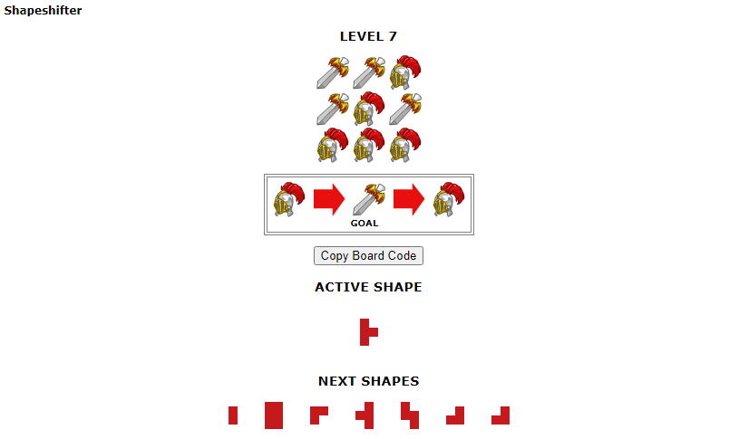
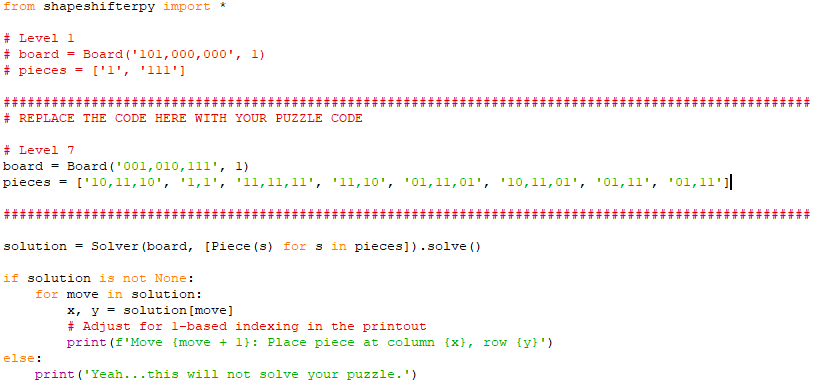
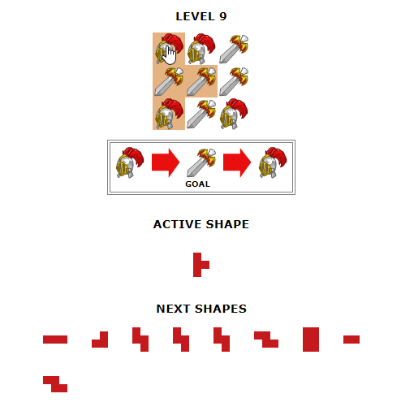
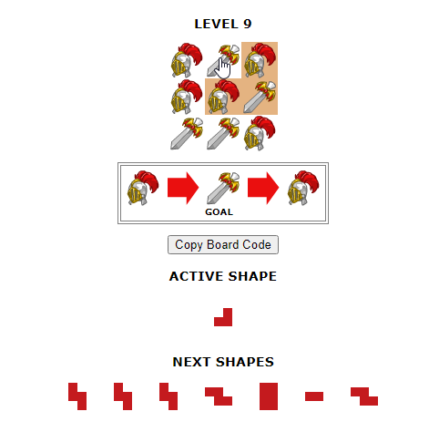
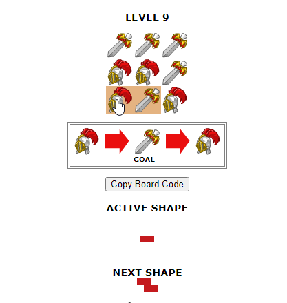
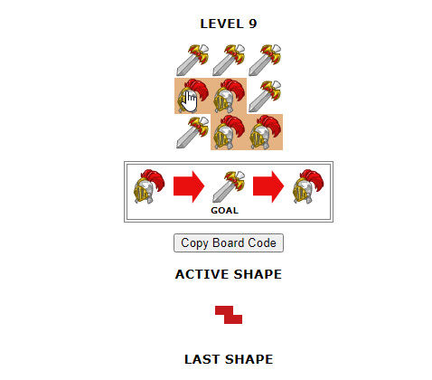

# Neopets Shapeshifter Solver 2024

## Requirements
* Python3 (https://www.python.org/downloads/)
* Greasemonkey/Tampermonkey browser extension (for Firefox or Chrome, from the app store)

## Installing
* Download the code as a zip, and unzip to an easy to access to folder (like on your desktop)
* Create a new script in your monkey extension. Copy, paste, and save the 'userscript.js' raw file. (Optionally clicking the raw button may auto install it into your monkey)

## Usage
Though this is for educational purposes, it has been stated by Neo-staff [citation needed (but it's there I swear)] that it's not cheating if you're the one inputting the answers._ So no automation!

Once you add the userscript to your browser, going to a [Shapeshifter](https://www.neopets.com/medieval/shapeshifter_index.phtml) puzzle will add a clickable button underneath the level goal that will copy the board code to your clipboard. 



You will paste this code into 'main.py'. You can't miss where it goes, trust me.


Save the newly edited file, then open your command prompt. Drag the file into the CMD, hit enter, and wait. The program will (hopefully) spit out a list of moves, they may look confusing but are easy to understand.

Columns and rows are numbered 0, 1, and 2, standing for the 1st, 2nd, and 3rd of each. Each piece is placed in a way that your mouse will be over whichever intercetion the python script gave.

## Examples
Let's use Level 9 as an example. Here is the output of moves python gives us.
```
Move 1: Place piece at column 0, row 0
Move 2: Place piece at column 0, row 0
Move 3: Place piece at column 1, row 0
Move 4: Place piece at column 0, row 0
Move 5: Place piece at column 0, row 0
Move 6: Place piece at column 0, row 0
Move 7: Place piece at column 0, row 0
Move 8: Place piece at column 0, row 0
Move 9: Place piece at column 0, row 2
Move 10: Place piece at column 0, row 1
```
Move 1 has the cursor in the 0,0 position.



Move 3 in the 1,0 position.



Move 9 in the 0,2 position.



And the last move in the 0,1 position.




## Notes from the previous author
* A C-implementation would be much faster, obviously.
  * Heck, even [cythonizing](https://cython.readthedocs.io/en/latest/src/tutorial/cython_tutorial.html) this script doubles the speed.
  * Making a CUDA version would be amazingly faster, being run on a GPU instead of CPU. Why mine altcoins when you can win at Neopets?
* Besides Level 1, every puzzle is randomly generated.
* As levels go higher:
  * the boards get bigger
  * pieces get bigger
    * and more numerous
  * the delta increases (so instead of toggling between 2 such as the gauntlet and the sword, it'll go through 3, 4, ...5? things! This DRASTICALLY increases execution time.)
* I wouldn't suggest letting this run more than a few hours, it's just not worth it. Turn it off, lose the level on purpose, and start over. If you're lucky, the new one will finish quickly.
* Don't finish puzzles on Neo too quickly. Looks bad for you.
